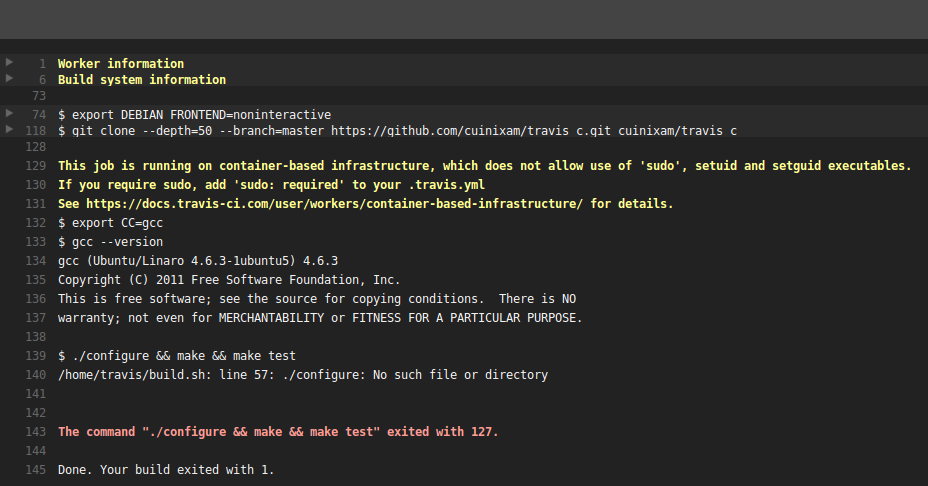

== Why setup up a Travis Ci file?

Well, let's say you developed your software normally and you have tests to verify
the correct behavior of the code you wrote :D

And now let's assume your best friend JARVIS wants to contribute also...
He makes some changes and then pushes them to your repository.

Now, you could trust JARVIS that: "I tested and it was working on my PC!" or you
could reproduce the same state of his commit on a fresh machine, run the tests
and in case of success deploy an executable :D

Travis CI provides you the environment (virgin Virtual Machines) to accomplish this!

== Minimal Travis CI file for building a C project

.Add the travis configuration file to the project:

_.travis.yml_

 language: c

.Enable the job on your Travis account
Google for "Travis CI getting started".

.Push a change to trigger the Travis CI job
It seems that the minimalistic configuration file is not enough to build a
project with a makefile.

.Job status

The problem is that by default Autotools and Make are assumed to be used.

TIP: Check which option must be changed to specify the script to be called

It seems that the script argument should solve our problem:
To build the project on my PC I run _make_.

_.travis.yml_

 language: c
 script: make

== References
* https://docs.travis-ci.com/user/languages/c/[]
* https://docs.travis-ci.com/user/getting-started/[]
